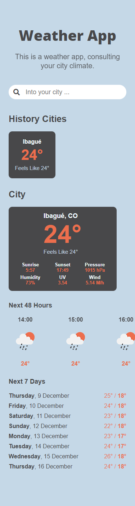

# **Weather-App** 🌎

This is a weather app, consulting your city climate.

## **Demo** 🚀

[View Demo](https://mooenz.github.io/weather-app/)

## **Tools** 🔨

- HTML
- SCSS
- JS Vanilla

## **Preview** 📷

## **Contact** 📧

- Linkedin [Mooenz](https://www.linkedin.com/in/mooenz/)
- Web Site [Curriculum Vitae](https://mooenz.github.io/curriculum-vitae/)

## **Licencie** 🛸

This project is MIT licensed
